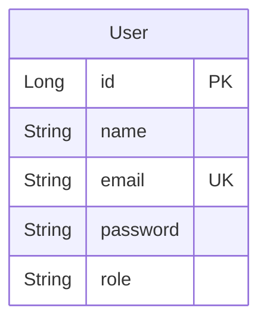

# Projeto final: Quarkus Avançado

## Criação de uma nova entidade que vai representar um usuário

Será necessário a criação de uma nova entidade que vai representar um usuário. Utilize o projeto final que você criou no módulo anterior.

Você pode utilizar o [Quarkus Security JPA](https://quarkus.io/guides/security-jpa#jakarta-persistence-entity-specification) para te ajudar.



## Adicionar segurança na aplicação com JWT

* Todas as operações de escrita, alteração e exclusão devem ser autenticadas. 
* Apenas usuários com o papel de `ADMIN` podem realizar essas operações.
* Usuários comuns devem ter a role de `USER` e não poderão realizar operações de escrita, alteração e exclusão, apenas leitura.

> ![NOTE]
> A aplicação deve iniciar com um usuário `ADMIN` com o nome `admin` e senha `admin` para facilitar os testes.
> Você pode fazer isso usando o `@Startup` e `@Transactional` para criar o usuário no banco de dados.
> Lembrando que isso é apenas para facilitar os testes, não é uma boa prática de segurança.

## API

* A API deve ter um endpoint para cadastro de usuário. 
Que deve ser acessível em `/users` e o método HTTP deve ser `POST`.
E deve receber o seguinte payload no corpo da requisição:

```json
{
    "name": "John Doe",
    "email": "john.doe@example.com",
    "password": "password123"
}
```

* Por padrão o usuário criado deve ter a role de `USER`.

* A API deve ter um endpoint para gerar um token JWT. Que deve ser acessível em `/auth/token` e o método HTTP deve ser `POST`.

* O formato da resposta deve ser um JSON com o token JWT. Por exemplo:
```json
{
    "token": "eyJhbGciOiJIUzI1NiJ9.eyJzdWIiO...", 
    "expiresIn": 3600
}
```

* A API deve ter um endpoint para buscar as informações do usuário logado. Que deve ser acessível em `/users/me`.
    * O método HTTP deve ser `GET`.
    * O usuário somente pode acessar as informações dele mesmo e não deve ser possível acessar as informações de outros usuários.

* O tempo de expiração do token deve ser de 1 hora e deve ser configurável através do arquivo de configuração do Quarkus (`application.properties`).

O cliente HTTP deve enviar o email e a senha do usuário no corpo da requisição. Por exemplo:

```shell
curl -X POST http://localhost:8080/auth/token -d '{"email": "email@email.com", "password": "senha"}' -H "Content-Type: application/json"
``` 

* Validação de email e senha:
    * Não deve ser possível cadastrar um usuário com email já existente. (Deve retornar o status code 409)
    * A senha deve ter no mínimo 8 caracteres. (Deve retornar o status code 400)
    * O email deve ser válido. (Deve retornar o status code 400)
    * O nome deve ser obrigatório. (Deve retornar o status code 400)
    * O nome não deve ser vazio ou nulo. (Deve retornar o status code 400)


# Considerações

Será disponibilizado uma atualização da ferramente de teste para o projeto final do segundo módulo.
